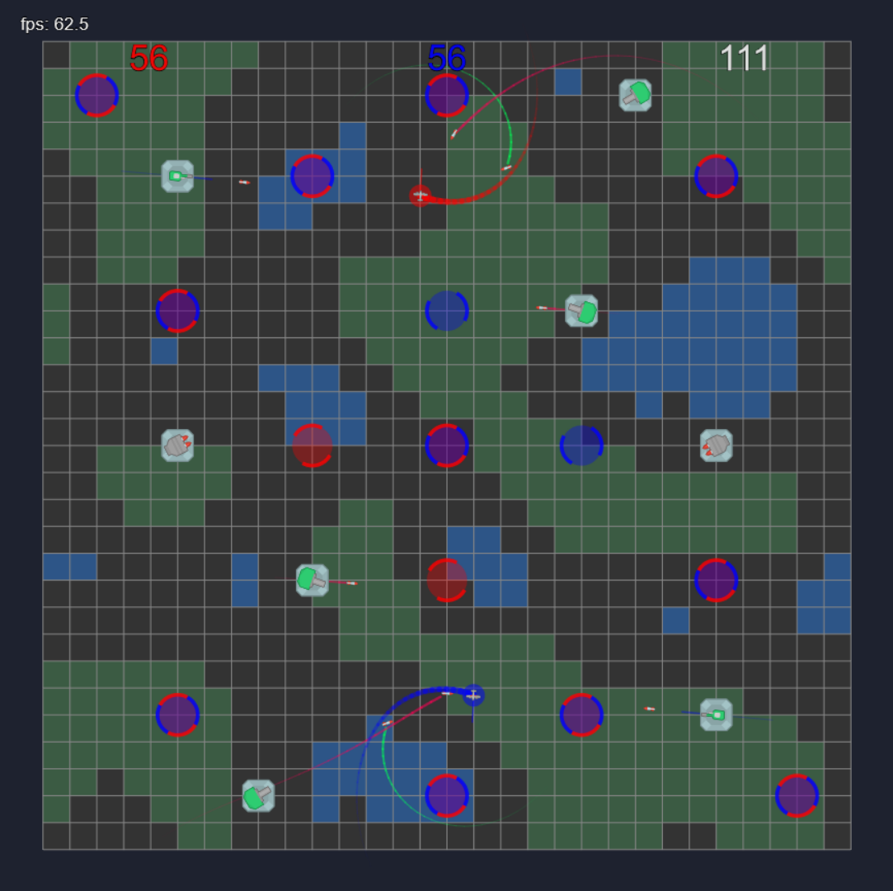
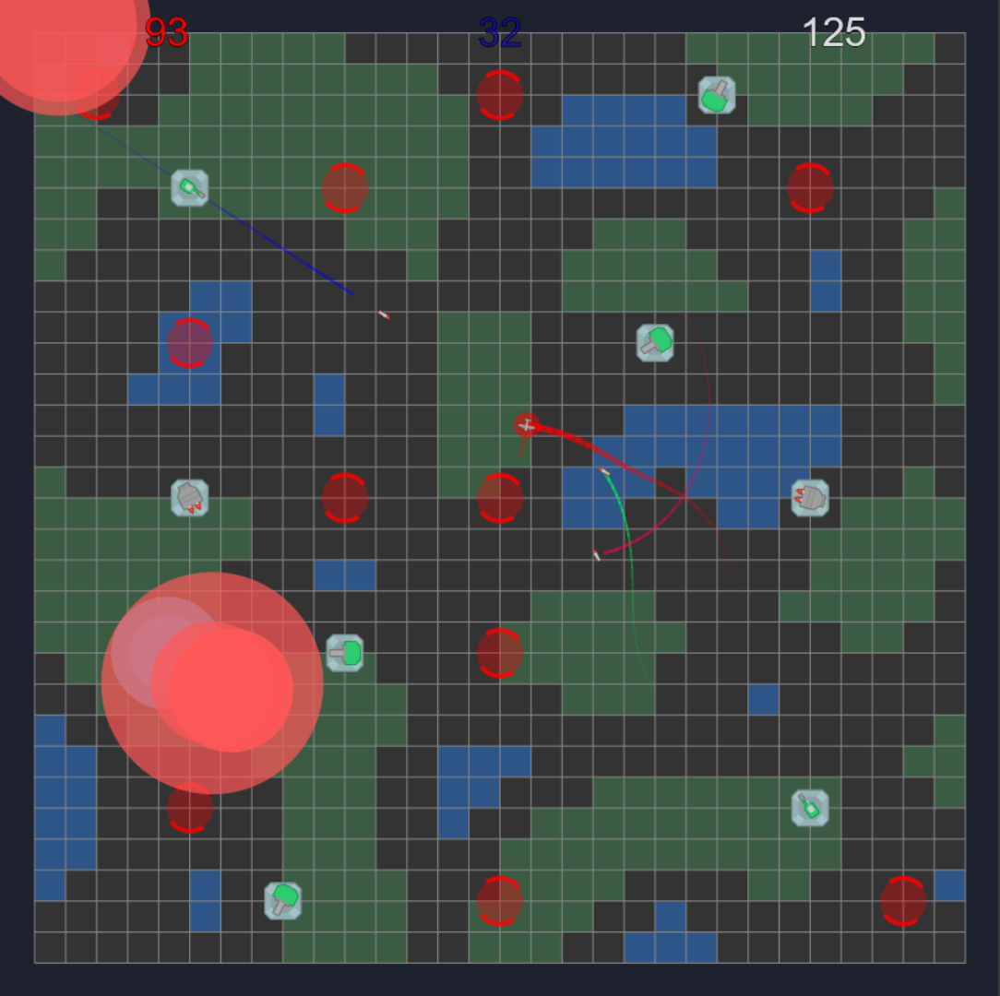
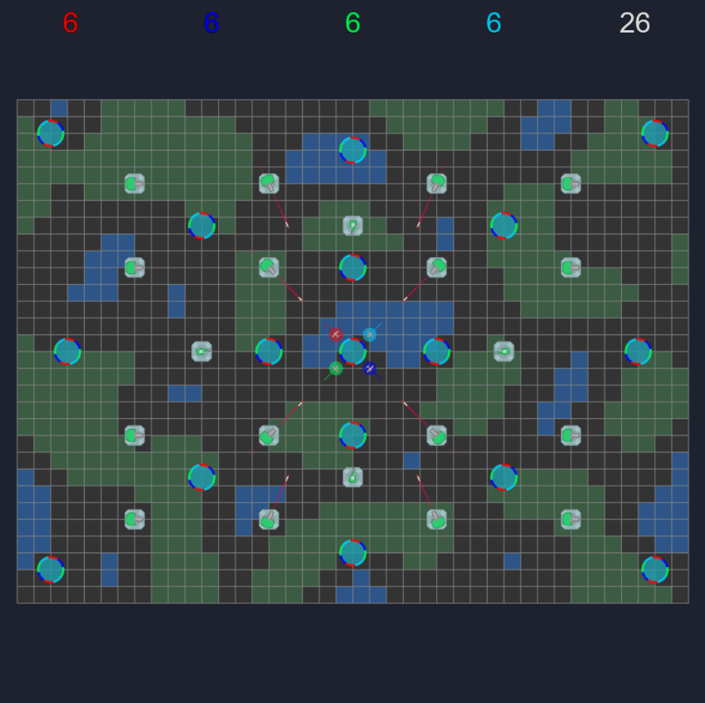

# Rocket Race
Браузерная игра для 1-4 игроков.

Задача игроков - собрать все контрольные точки, избегая попаданий ракет и их взрывов.

## Скриншоты

## Особенности
- Поддержка нескольких игроков (зависит от выбранной карты)
- Несколько уровней, возможно добавление новых
- Интуитивно понятный геймплей
- Босс-битва после сбора всех контрольных точек
- Открытый исходный код

## Управление
- Пауза/меню - `Esc`

| Игрок   | Цвет    | Ускорение | Поворот ↪  | Поворот ↩    |
|---------|---------|-----------|-------------|--------------|
| Игрок 1 | Красный | `W`       | `A`         | `D`          |
| Игрок 2 | Синий   | `ArrowUp` | `ArrowLeft` | `ArrowRight` |
| Игрок 3 | Зелёный | `I`       | `J`         | `L`          |
| Игрок 4 | Голубой | `Num8`    | `Num4`      | `Num6`       |

Сенсорный ввод не поддерживается 😢

## TODO
- Поддержка сенсорного управления
- Поддержка геймпадов
- Фоновая музыка и звуки
- Больше спецэффектов
- Редактор карт
- Сохранение лучшего результата
- Сохранение реплеев

## Ресурсы
Текстуры - [Kenney](https://kenney.nl/) ([CC0 1.0 Universal](https://creativecommons.org/publicdomain/zero/1.0/))
